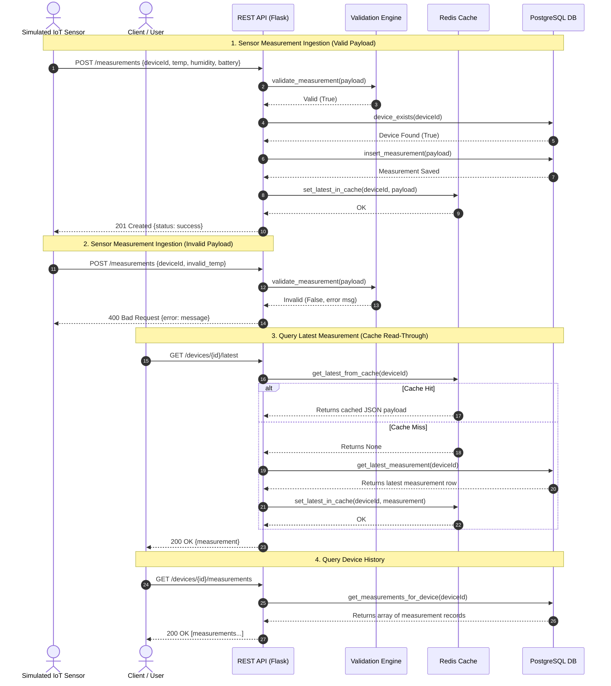

# Jensen IoT Platform - Lab Assignment Complete Guide

## Overview

This guide provides a step-by-step walkthrough for completing the **Data Platforms, Data Integration and Cloud Solutions** lab assignment.

The purpose of this project is to build a realistic cloud-based IoT data platform where simulated environmental sensors send temperature, humidity, and battery readings to a REST API. The API validates the data, stores persistent historical readings in a PostgreSQL database, caches the latest reading in Redis for fast retrieval, and runs as a containerized solution locally with Docker Compose and as a demo on Kubernetes (Minikube).

---

## System Architecture & Components

The solution consists of 4 primary services:

1. **REST API (Flask / Python)** (`api/`):
   - Validates incoming sensor payloads.
   - Saves valid measurements to PostgreSQL.
   - Caches and retrieves the latest sensor reading using Redis.
   - Exposes REST endpoints for client applications.

2. **PostgreSQL Database** (`database/`):
   - Stores device information and historical measurement records persistently.

3. **Redis Cache** (`api/cache.py`):
   - Serves as an in-memory key-value cache for quick access to the latest measurement per sensor.

4. **Sensor Simulator** (`simulator/`):
   - Simulates 3 sensors sending valid readings continuously and intentionally invalid readings to test validation.

5. **Kubernetes Cluster (Minikube)** (`k8s/`):
   - Orchestrates the API with 3 pod replicas, demonstrating high availability, scaling, and self-healing.

---

## System Sequence Diagram

The following sequence diagram illustrates the runtime interactions between simulated sensors, REST API validation, PostgreSQL persistent database, Redis cache, and external users:



### How to Validate Sequence Diagram Flows Locally

Follow these steps to test each flow in the sequence diagram on your machine:

1. **Start Environment**:
   ```bash
   docker compose up --build -d
   ```

2. **Flow 1: Valid Measurement Ingestion (`201 Created`)**
   ```bash
   curl -i -X POST http://localhost:5001/measurements \
     -H "Content-Type: application/json" \
     -d '{"deviceId": "sensor-001", "temperature": 22.5, "humidity": 45.0, "battery": 95.0}'
   ```

3. **Flow 2: Invalid Measurement Rejection (`400 Bad Request`)**
   ```bash
   curl -i -X POST http://localhost:5001/measurements \
     -H "Content-Type: application/json" \
     -d '{"deviceId": "sensor-001", "temperature": 150.0, "humidity": 45.0, "battery": 95.0}'
   ```

4. **Flow 3: Query Latest Measurement & Redis Cache Read-Through**
   ```bash
   # Read from cache / database
   curl http://localhost:5001/devices/sensor-001/latest

   # Verify key in Redis
   docker compose exec redis redis-cli KEYS "latest:*"

   # Test cache miss (flush Redis & retry query)
   docker compose exec redis redis-cli FLUSHDB
   curl http://localhost:5001/devices/sensor-001/latest
   ```

5. **Flow 4: Query Device History**
   ```bash
   curl http://localhost:5001/devices/sensor-001/measurements
   ```

6. **Run Automated Test Suite**
   ```bash
   docker compose exec api python -m pytest -q
   ```

---

## Environment Setup & Prerequisites

Before starting, ensure the following tools are installed:

- **Git & GitHub Account**
- **Docker Desktop** (or Docker Engine + Docker Compose)
- **VS Code** (or preferred editor)
- **kubectl** & **Minikube**

Verify setup by running:

```bash
git --version
docker --version
docker compose version
kubectl version --client
minikube version
```

### Installing `kubectl` and `minikube` (Windows)

If `kubectl` or `minikube` are not installed on your system, install them using PowerShell (Admin):

**Option 1: Using `winget` (Recommended)**
```powershell
winget install Kubernetes.kubectl
winget install Kubernetes.minikube
```

**Option 2: Using `choco` (Chocolatey)**
```powershell
choco install kubernetes-cli minikube -y
```

> **Note:** After installation, restart your terminal window before verifying the versions. Ensure **Docker Desktop** is running before starting Minikube.

---

## Step-by-Step Implementation Plan

### Milestone 1: API Development, Data Validation, & Database Persistence

#### 1. Start local Docker Compose environment
```bash
docker compose up --build -d
docker compose ps
```

#### 2. Implement Data Validation (`api/validation.py`)
Ensure incoming payloads are verified before database storage:
- Validate required fields (`deviceId`, `temperature`, `humidity`, `battery`).
- Validate data types and ranges:
  - `temperature`: float/int (-50°C to 100°C)
  - `humidity`: float/int (0% to 100%)
  - `battery`: float/int (0% to 100%)
- Return clear error messages when validation fails.

#### 3. Implement PostgreSQL Operations (`api/db.py`)
- Implement `device_exists(device_id)`: Checks if `device_id` exists in the `devices` table.
- Implement `insert_measurement(data)`: Inserts a valid reading into `measurements` using parameterized queries (`%s`).
- Implement `get_measurements_for_device(device_id)`: Retrieves historical readings for a device.
- Implement `get_latest_measurement(device_id)`: Retrieves the most recent reading for a device.

#### 4. Complete REST API Endpoints (`api/app.py`)
- `POST /measurements`:
  - Validate payload.
  - Return `400 Bad Request` if payload is invalid or `deviceId` is unknown.
  - Return `201 Created` only when measurement is saved to DB.
- `GET /measurements`: Return list of latest measurements (`200 OK`).
- `GET /devices`: Return list of registered devices (`200 OK`).
- `GET /devices/<device_id>/measurements`: Return sensor history (`200 OK` or `404 Not Found` if device does not exist).
- `GET /devices/<device_id>/latest`: Return latest sensor reading (`200 OK` or `404 Not Found`).

#### 5. Add Pytest Validation Tests (`api/tests/test_validation.py`)
Add at least 3 new tests:
- Payload with missing `deviceId`
- Invalid data type for `humidity`
- Invalid data type for `battery`

Run tests using:
```bash
docker compose exec api python -m pytest -q
```

#### 6. Mandatory SQL Tasks
Log into PostgreSQL client:
```bash
docker compose exec db psql -U student -d jensen_iot
```
Run and verify 3 mandatory queries:
1. **Total measurement count**:
   ```sql
   SELECT COUNT(*) FROM measurements;
   ```
2. **Average temperature**:
   ```sql
   SELECT AVG(temperature) FROM measurements;
   ```
3. **Readings from last 24 hours**:
   ```sql
   SELECT * FROM measurements WHERE timestamp >= NOW() - INTERVAL '24 hours';
   ```
Exit with `\q`. Copy queries and explanations into `README.md`.

---

### Milestone 2: Docker Environment & Redis Caching

#### 1. Implement Redis Cache Methods (`api/cache.py`)
- `set_latest_in_cache(device_id, measurement)`: Serialize dictionary to JSON string (`json.dumps`) and save to key `latest:<device_id>`.
- `get_latest_from_cache(device_id)`: Retrieve key from Redis and deserialize (`json.loads`).

#### 2. Connect Cache to API (`api/app.py`)
- In `GET /devices/<device_id>/latest`:
  1. Check Redis cache first.
  2. On cache hit: Return cached reading.
  3. On cache miss: Retrieve from PostgreSQL DB, populate Redis cache, and return reading.
- In `POST /measurements`:
  - Update Redis cache whenever a new measurement is stored in DB.

#### 3. Cache Resilience Verification
```bash
# Verify keys in Redis
docker compose exec redis redis-cli KEYS "latest:*"

# Clear Redis cache
docker compose exec redis redis-cli FLUSHDB
```
After flushing Redis, `GET /devices/<device_id>/latest` should still successfully return data by fetching from PostgreSQL and re-populating Redis.

---

### Milestone 3: CI Pipeline & Kubernetes Deployment

#### 1. GitHub Actions CI (`.github/workflows/ci.yml`)
Create `.github/workflows/ci.yml` with the following workflow:

```yaml
name: CI
on: [push, pull_request]

jobs:
  test-and-build:
    runs-on: ubuntu-latest
    steps:
      - uses: actions/checkout@v4
      - uses: actions/setup-python@v5
        with:
          python-version: "3.12"
      - run: pip install -r api/requirements.txt
      - run: python -m pytest tests -q
        working-directory: api
      - run: docker build -t jensen-iot-api:ci ./api
```

#### 2. Minikube Kubernetes Demonstration
Start cluster and build API image inside Minikube:
```bash
minikube start --driver=docker
minikube image build -t jensen-iot-api:lab ./api
kubectl apply -f k8s/deployment.yaml
kubectl apply -f k8s/service.yaml
kubectl get pods
```

#### 3. Test Service & Observe Behavior
- Access service:
  ```bash
  minikube service jensen-iot-api
  ```
- **Self-Healing Test**: Delete a running Pod and watch Kubernetes recreate it:
  ```bash
  kubectl delete pod <pod-name>
  kubectl get pods -w
  ```
- **Scaling Test**: Scale replicas up to 5 and back down to 3:
  ```bash
  kubectl scale deployment jensen-iot-api --replicas=5
  kubectl get pods
  kubectl scale deployment jensen-iot-api --replicas=3
  kubectl get pods
  ```

---

### Milestone 4: Deliverables & Final Checklist

Ensure all 4 deliverables are ready in your repository:

1. **Working Application & Tests**:
   - `docker compose up --build -d` runs cleanly.
   - All tests pass: `docker compose exec api python -m pytest -q`.
   - Continuous Integration build is passing (green) on GitHub.

2. **`README.md`**:
   - Overview of the system, setup instructions, how to run tests, and the 3 mandatory SQL queries.

3. **`docs/architecture.md` (Architecture Diagram)**:
   - Export diagram (PNG or PDF) showing sensors, REST API, PostgreSQL, Redis, Docker Compose, CI pipeline, and Kubernetes deployment.
   - Link or embed the diagram and describe key architecture decisions.

4. **`docs/reflection.md` (Reflection Document)**:
   - Complete clear answers for all 10 reflection questions explaining the trade-offs between API vs direct DB access, PostgreSQL vs Redis, Docker Compose vs Kubernetes, self-healing, scaling, and CI automation.

---

## Submission Commands

Commit and push all changes to your GitHub fork:

```bash
git add .
git commit -m "Complete Jensen IoT Platform assignment implementation and documentation"
git push origin main
```
