# System Architecture - Jensen IoT Platform

## Overview & Architecture Diagram

This document describes the complete architecture and data flows for the Jensen IoT Data Platform.

```mermaid
flowchart TB
    subgraph CI_Pipeline ["CI Pipeline (GitHub Actions)"]
        A[GitHub Push / Pull Request] --> B[CI Workflow]
        B --> C[Run Pytest Tests]
        C --> D[Build Docker Image]
    end

    subgraph Local_Docker_Compose ["Local Runtime Environment (Docker Compose)"]
        subgraph Sensors ["Simulated IoT Sensors"]
            S1[Sensor 001]
            S2[Sensor 002]
            S3[Sensor 003]
        end

        Sensors -- "1. HTTP POST /measurements (Write-Heavy Stream)" --> API[REST API - Flask]

        subgraph Caching ["In-Memory Cache"]
            REDIS[(Redis Cache - Latest Values)]
        end

        subgraph Persistence ["Persistent Storage"]
            PG[(PostgreSQL DB - Historical Readings)]
        end

        API -- "2a. Write / Read SQL (Persistent)" --> PG
        API -- "2b. Write / Read Cache (Latest)" --> REDIS

        USER[Client / User] -- "3. HTTP GET /devices/id/latest (Cached)" --> API
        USER -- "4. HTTP GET /devices/id/measurements (History)" --> API
    end

    subgraph K8s_Demo ["Kubernetes Cluster Demo (Minikube)"]
        K8S_USER[User / Client] -- "HTTP GET /" --> SVC[K8s Service - NodePort]
        SVC --> DEP[K8s Deployment - 3 Replicas]
        subgraph Pods ["Pod Replicas"]
            P1[Pod Replica 1]
            P2[Pod Replica 2]
            P3[Pod Replica 3]
        end
        DEP --> P1
        DEP --> P2
        DEP --> P3
    end
```

---

## Architectural Choices & Key Components

### 1. Local Runtime Environment (Docker Compose)
- **Simulated Sensors**: 3 IoT devices (`sensor-001`, `sensor-002`, `sensor-003`) continuously emit environmental measurements (temperature, humidity, battery).
- **REST API (Flask)**: Validates incoming payloads and coordinates writes to persistent storage and cache.
- **Write-Heavy Data Flow**: The ingestion stream (`HTTP POST /measurements`) is high volume. Data validation prevents corrupt values from reaching storage.
- **PostgreSQL Database**: Used as the **durable, persistent source of truth** for historical measurements. Relational structure guarantees data integrity over time.
- **Redis Cache**: Acts as an **in-memory caching layer** for fetching the latest sensor reading (`GET /devices/<id>/latest`). This significantly reduces PostgreSQL read load.

### 2. CI Pipeline (GitHub Actions)
- Triggers on `push` and `pull_request` to the main repository.
- Automatically checks out code, installs dependencies, executes `pytest` validation suites, and verifies Docker image compilation.

### 3. Kubernetes Cluster Demo (Minikube)
- Demonstrates application scaling and orchestration.
- **Deployment**: Configured with **3 Pod Replicas** for high availability.
- **Service**: Exposes a NodePort entry point routing external user traffic across healthy Pod instances.
- **Self-Healing & Scaling**: Automatically replaces terminated pods and allows scaling up/down dynamically.
